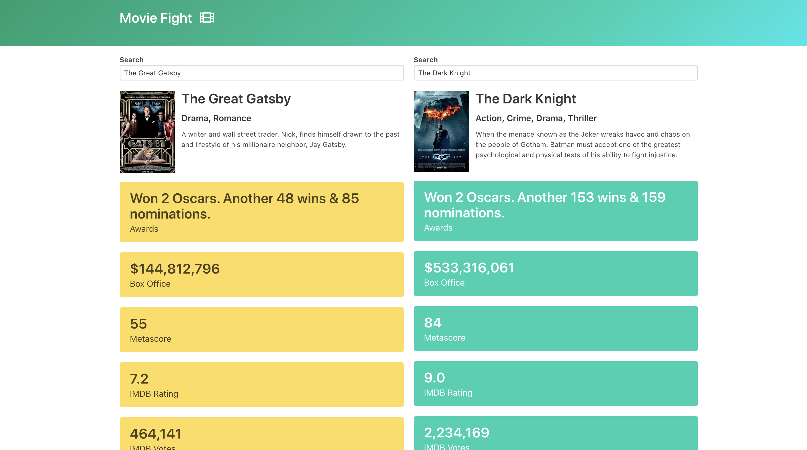

# Movie Fight

User searches a movie on the right and left side of the app and dropdown appears, user's choice is updated in the search input. User can see the movie's summary info, also a comparison for the movies. The higher values are highlighted in blue, and lower values are highlighted in yellow.

Project uses [omdbapi](http://www.omdbapi.com/)

## Plan of Attack

- Identify challenging aspects 
    - fetch data about movies
        - use by search and By ID or Title parameters. Id for each movie, search for general search the database.
    - autocomplete widget from scratch
    - bulma css
  

